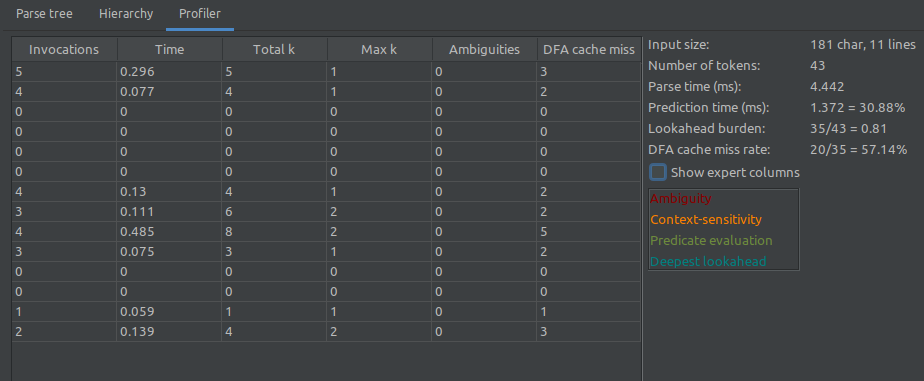
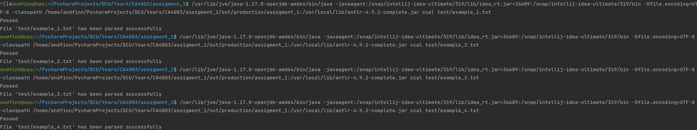

# Assigment 1 -> Andrew Finn - 18XXXXXX

## Description

Overall the assigment has been quite interesting. Setting up Antlr was a project in itself.

However, IntelliJ has been a godsend, with automated syntax highlighting, error checking and ambiguity checks built in.
This made the repetitive and back and forth progress go a lot quicker than changes and fixes could be verified MUCH
quicker. IntelliJ also allowed me to easily specify the Antlr java jar as an external project dependency.

The assigment really drove home how easy ambiguity is grammars and how edge cases are hard to invision to easy to crop
up. For the purpose of this assigment I am assuming -0 is an invalid variable.

The CCAL Spec given as part of the assignment was very close to Antlr syntax. As such the main process was simply
converting the spec rules to Antlr syntax and dealing with the Antlr funkiness.

During the course of the assignment i also walked myself down more than a few self-inflicted issues, such as Antlr
variables being only made up of non Ascii characters, Copying symbols from spec directly gave funky characters instead
of the expected ones (-/minus in particular, debugged that one for far longer than I care to admit ended up started from
scratch till a classmate noticed the non-standard symbol ... Thanks, Adobe OCR!)

## Screenshots

## Declaration on Plagiarism

Assignment Submission Form

This form must be filled in and completed by the student(s) submitting an assignment

- Name(s): Andrew Finn
- Programme: CASE
- Module Code: CA4003
- Assignment Title: Assigment 1
- Submission Date: 20 October 2021 (Approx)
- Module Coordinator: Dr David Sinclair

I/We declare that this material, which I/We now submit for assessment, is entirely my/our own work and has not been
taken from the work of others, save and to the extent that such work has been cited and acknowledged within the text of
my/our work. I/We understand that plagiarism, collusion, and copying are grave and serious offences in the university
and accept the penalties that would be imposed should I engage in plagiarism, collusion or copying. I/We have read and
understood the Assignment Regulations. I/We have identified and included the source of all facts, ideas, opinions, and
viewpoints of others in the assignment references. Direct quotations from books, journal articles, internet sources,
module text, or any other source whatsoever are acknowledged and the source cited are identified in the assignment
references. This assignment, or any part of it, has not been previously submitted by me/us or any other person for
assessment on this or any other course of study.

I/We have read and understood the referencing guidelines found at
http://www.dcu.ie/info/regulations/plagiarism.shtml , https://www4.dcu.ie/students/az/plagiarism
and/or recommended in the assignment guidelines.

Name(s): **Andrew Finn**
